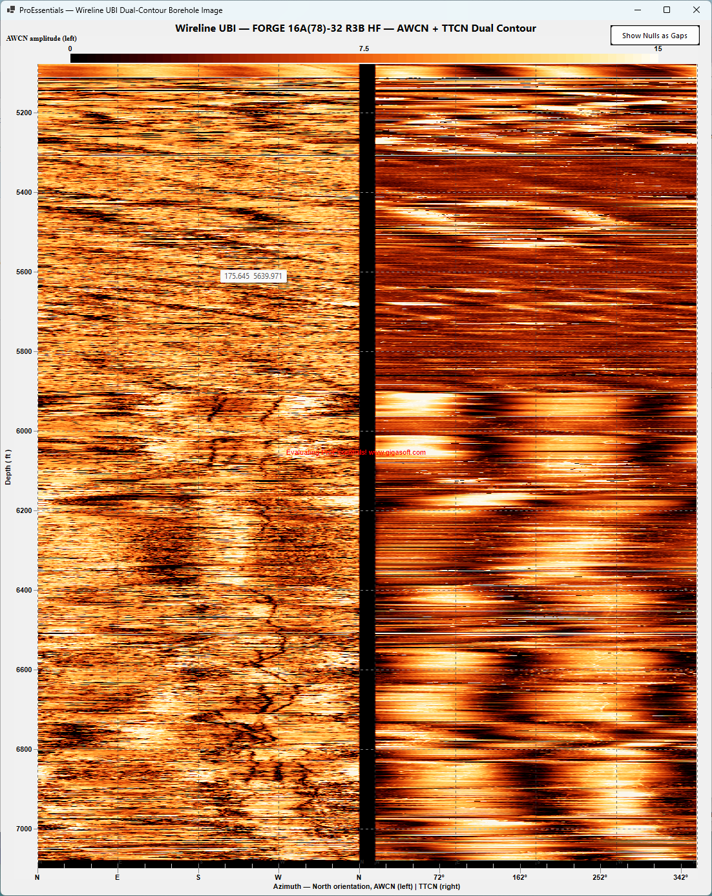

# Wireline UBI — Dual-Contour Borehole Image — WinForms

ProEssentials v10 **WinForms .NET 8** — dual-channel ultrasonic borehole image
(AWCN amplitude + TTCN transit time) rendered as a single concatenated contour
chart sharing one colormap, one zoom, one rendering pass. A top-right overlay
button toggles null rendering (Black / Gaps). Direct3D + GPU compute shader.

## What This Demonstrates
- **Dual heatmaps in one chart** — two co-registered azimuthal channels
  concatenated along X with a null-data gutter between them.
- **Parallel data loading** — both ~34 MB UTF-16 files load concurrently via
  `Task.Run`, with a span-based single-pass parser.
- **Null-rendering toggle** — flips `NullDataValueZ` between -999 (Z=0 renders
  black) and 0 (cells become mesh holes) with no data re-push.
- **`PeCustomGridNumber`** relabels X gridlines as compass markers (N/E/S/W) per
  channel; compass line annotations overlay the chart.
- **Code-built UI** — chart + floating overlay button in `MainForm.cs`; no
  `.Designer.cs` / `.resx`.

## WinForms vs WPF
The parallel loader, channel concatenation, the `PeCustomGridNumber` handler, and
the entire chart configuration are identical to the WPF version. Host changes:
`Screen.PrimaryScreen.WorkingArea` (was `SystemParameters.WorkArea`), WinForms
`MessageBox`, `Application.Exit()`, `System.Drawing.Color`, and the overlay
button is parented to the chart control and anchored top-right (WPF placed it in
the same Grid cell).

➡️ WPF version: [wpf-chart-ultrasonic-borehole-image-dual-contour-heatmap](https://github.com/GigasoftInc/wpf-chart-ultrasonic-borehole-image-dual-contour-heatmap)

## Data Files
`TestData_FORGE_AWCN_clipped.txt` and `TestData_FORGE_TTCN_clipped.txt`
(~34 MB each) are **not** included. Place both in the project root; they copy
next to the executable on build. The `tools/` folder has the Python extractors.

## How to Run
1. Clone; put both `TestData_FORGE_*` files in the root
2. Open `WirelineUbi.sln` in Visual Studio 2022
3. Build → Rebuild Solution; press F5. Toggle null mode top-right.

## NuGet
References `ProEssentials.Chart.Net80.x64.Winforms` (>= 10.0.0.28).

## License
Example code is MIT licensed. ProEssentials requires a commercial license. Well-log
data: Utah FORGE Geothermal Data Repository (CC-BY 4.0).
